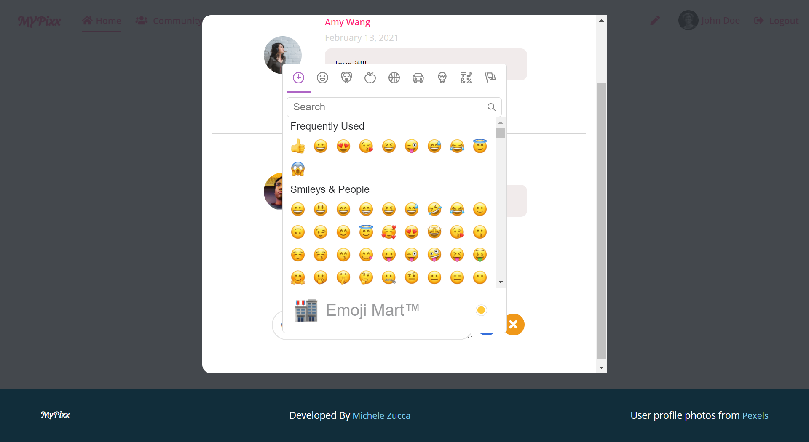

# MYPixx MERN APP (React Js, Redux, Sass, MongoDB, ExpressJS, NodeJS, JWT, Google Auth)
MYPixx is a social media art gallery where users can register and share their artwork

# Table of contents:

- [Overview](#overview)
- [Tech Stack Used](#tech-stack-used)
- [Sign Up](#sign-up)
- [Sign In](#sign-in)
- [User Profile](#user-profile)
- [Add, edit, delete pictures](#add-edit-delete-pictures)
- [Community](#community)
- [Likes and Comments](#likes-and-comments)
- [Database](#database)
- [Models](#models)
- [Deployment](#deployment)

# Overview
MYPixx is a social media art sharing app for art fanatics. Users can register an account or sign in with Google, create their own gallery work, update their profile, edit, delete their pictures, comment or like other users' work.

# Tech Stack Used
- JavaScript 
- Sass
- React Js 
- Redux
- Axios
- Node Js
- Express
- Mongo DB
- Mongoose
- JSON Web Tokens
- Google Auth

# Sign Up
Users can register on MYPixx creating a new account. The app uses React validators to check proper input filling and checks whether users are already registered. 

# Sign In
Users can sign in either after creating a new account or directly sign in using Google authentication. In case a user signs in with Google, a new User model will be created the first time the user signs in. Both sign in use JSON Web Tokens for authentication.

# User Profile
Users can view and edit their profile, switch view and check their own photos. Users can edit details such as personal info or medium used in their artwork (i.e. painting, photography, digital art). The app checks whether a user is signed in as Google user, and doesn't allow Google users to update their profile.

# Add, edit, delete pictures
Only signed in and authorized users can add, edit or delete their own artwork. A guest user with no registered account or Google authentication can still view users' profiles and artwork.

# Community
The community page offers an overview of users, most commented and most likes pictures. It is also accessible to guest users.

# Likes and Comments
Register users can like and comment on each other's other artwork, reply to comments, like comments and comment replies. When adding comment users can use emojis thanks to the emoji-mart React library.

# Deployment
The app is deployed on Heroku and can be found at the following link: https://mypixx.herokuapp.com/

## License
Copyright (c) Michele Zucca Web Dev
